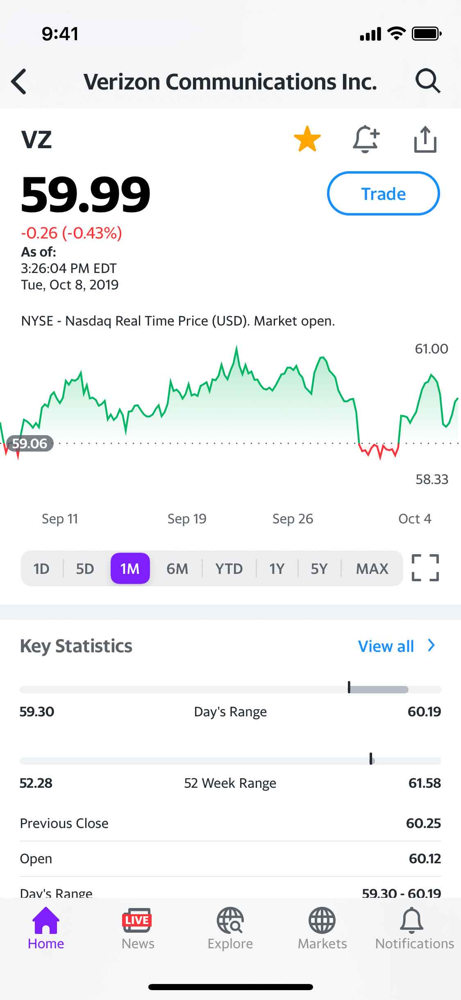

# Stock Watcher

Stock Watcher ist eine mobile App, mit der die Aktienmärkte in Echtzeit verfolgt werden können.
Die App bietet Benutzern detaillierte Informationen zu bestimmten Aktien, darunter die neuesten Kurse, historische Daten und relevante Nachrichtenartikel.
Darüber hinaus enthält Stock Watcher eine einzigartige Social-Feed-Funktion, mit der Benutzer Diskussionen über Aktien erstellen und daran teilnehmen können.

## Geplantes Design

Füge hier einige repräsentative Designs deiner App ein (z.B. aus Figma)

  
  

## Features
Hier kommen alle geplanten Features der App rein mit dem Status, ob es bereits umgesetzt wurde.

- [ ] • Aktienverfolgung: Erhalten Sie Echtzeit-Updates zu Aktienkursen und -performance.
- [ ] • Aktiendetails: Sehen Sie sich detaillierte Informationen zu einzelnen Aktien an, einschließlich historischer Daten, Performancediagrammen und relevanter Nachrichten.
- [ ] • Newsfeed: Bleiben Sie mit den neuesten Nachrichtenartikeln zu den Aktien, die Sie interessieren, auf dem Laufenden.
- [ ] • Social Feed: Engagieren Sie sich in der Community, indem Sie an öffentlichen Gesprächen über verschiedene Aktien teilnehmen.Erstellen Sie Diskussionen, antworten Sie anderen und teilen Sie Ihre Gedanken.

## Technischer Aufbau

#### Projektaufbau
MVVM Architektur und auf features aufgeteilt.

#### Datenspeicherung
Firebase.Firestore benutzen wurde fur watchlist items speicherung 
Firebase.Authentication wurde benutzen fur registrierung und authentifizierung der Nutzer.

#### API Calls
Financial Modeling Prep API #1
Endpoint #1: https://financialmodelingprep.com/api/v3/quote/{AAPL,MSFT} 
Endpoint #2: https://financialmodelingprep.com/api/v3/search-ticker?query={AA}&limit={10}&exchange={NASDAQ}
Endpoint #3: https://financialmodelingprep.com/api/v3/profile/{AAPL}
Endpoint #4: https://financialmodelingprep.com/api/v3/historical-chart/{5min}/{AAPL}?from={2023-08-10}&to={2023-09-10}
Endpoint #5: https://www.alphavantage.co/query?function=NEWS_SENTIMENT&tickers={AAPL}&apikey={demo}
Endpoint #6: https://www.alphavantage.co/query?function=TOP_GAINERS_LOSERS&apikey={demo}

#### 3rd-Party Frameworks
 Die eine Framework das ich verwende wurde Firebase Package sein . 

## Ausblick
Beschreibe hier, wo die Reise nach deinem Praxisprojekt hin geht. Was möchtest du in Zukunft noch ergänzen? Erstelle auch hierzu Issues und verlinke sie, wie oben.
 
